# Task 3 V1 - Causal-Semantic Reconstruction of LLM Internal Workspaces

Last updated: 2026-07-27

Version: **V1 baseline**. Future redesign work belongs in `task3_v2`.

This is the main overview of Task 3. It contains the task definition, complete
experimental stages, current small-scale experiment, results, and next
decision. Task 1/2 remain documented in the repository root `README.md`.

## 1. Definition

Given a frozen open-weight LLM, prompts from multiple environments, internal
activations at selected layers, a fixed J-space feature readout, and semantic
labels for only some features, Task 3 aims to recover the semantic meanings of
the unlabeled internal features.

The primary research question is:

> Can our graph-semantic reconstruction method recover masked semantic
> meanings from J-space features better than appropriate baselines?

The graph is an experimental input to semantic reconstruction. It may be
fixed or controlled, as in Task 1/2, or supplied by an exploratory J-space
discovery track. Causal discovery is not a prerequisite for the core semantic
recovery test.

The **core Task 3 success condition** is that, given a frozen graph and partial
labels, our semantic solver improves masked semantic recovery over no-graph,
correlation-graph, and shuffled-graph controls. Intervention validation is
required only when making causal claims about a discovered graph. Behavioral
prediction, cross-prompt generalization, and cross-model replication remain
follow-up questions.

Possible later extensions include anonymous features and latent mechanisms,
but latent semantics should be claimed only when additional identifiability
conditions are available.

Task 3 does not claim to recover the complete true causal graph of an LLM.
Observational discovery cannot eliminate hidden confounding, and J-space
coordinates are not automatically causal variables. Generic autoencoder
latents are also not identifiable causal variables without further
assumptions or intervention information.

### Current methodological issue

- The current Stage 1 adds a harder causal-discovery problem as a gate, whereas
  Task 1/2 starts from a given graph and tests recovery of missing semantics.
- `concept@layer` nodes are repeated measurement views of one concept rather
  than clearly distinct semantic variables, so same-concept propagation
  naturally dominates.
- The 32 probe tokens do not form a known ground-truth causal system; a sparse,
  stable cross-concept DAG is therefore not guaranteed.
- A J-space coordinate is a hidden-state projection, not an independently
  identified causal variable. Unmeasured hidden dimensions can violate causal
  sufficiency, and a single-source write shows total downstream effect rather
  than a direct CauScale edge.

Therefore, J-space causal discovery should be reported as an optional
diagnostic track, not as a mandatory gate for semantic recovery.

## 2. Complete experiment

```mermaid
flowchart LR
    A["Frozen LLM"] --> B["Selected-layer activations"]
    B --> C["Fixed J-space features"]
    C --> D["Sample-by-feature matrix"]
    D --> E["Candidate structure"]
    E --> F["Bootstrap filtering"]
    F --> G["Held-out graph validation"]
    G --> H["Core test: masked semantic recovery"]
    H --> I["Follow-up: behavioral grounding"]
    I --> J["Follow-up: replication"]
```

Feature extraction occurs before causal discovery. CauScale receives a
numeric sample-by-feature matrix, not raw hidden states or semantic names.

| stage | purpose | primary test | pass requirement |
|---|---|---|---|
| **1. Graph validation** | Establish whether the graph is credible enough to supply structural constraints | Controlled writes on held-out prompts | Beat correlation, architecture-only, and degree/layer-matched random controls |
| **2. Semantic recovery - core Task 3 test** | Test whether our method recovers masked J-space meanings | Mask 20% of concepts across all layers | Beat no-graph, correlation-graph, and shuffled-graph semantic solvers |
| **3. Behavioral grounding - follow-up** | After successful recovery, test whether recovered meanings predict output changes | Compare concept-specific intervention effects with matched distractors | Beat shuffled labels/distractors and show a stable dose response |
| **4. Generalization - follow-up** | Test robustness beyond one prompt distribution and model | Cross-environment evaluation and a second frozen LLM | Consistent trends and directional replication |

Stage 2 is the primary test of whether our method is useful on J-space and can
proceed with a fixed or controlled graph. Stage 1 is mandatory only if the
experiment claims that an observationally discovered J-space graph is causal;
failure blocks that causal interpretation, not the core fixed-graph semantic
recovery test. Stages 3 and 4 remain follow-up tests after successful semantic
recovery.

For Stage 2, concept masking must hide all layer coordinates of a concept
together. Token IDs, token strings, dictionary rows, filenames, and other
identity leaks must be removed. Primary metrics are MatchAcc, JudgeAcc, top-k
concept recall, and degradation after graph shuffling.

For Stage 3, a useful summary is:

$$
\operatorname{SIS}(u)=
\Delta\log p(\text{decoded concept output})
-\operatorname{mean}_{d}\Delta\log p(\text{distractor output}).
$$

A single-source intervention measures total downstream effect or reachability.
It does not by itself prove that a particular direct edge exists; direct-edge
claims require mediator or path-blocking interventions.

## 3. Current small-scale experiment

**Current position: Stage 1.**

| item | current setting |
|---|---|
| frozen model | `Qwen/Qwen3.5-4B` |
| readout | `neuronpedia/jacobian-lens`, revision `qwen-n1000` |
| selected layers | 8, 16, 24, 30 |
| measurement position | final prompt token |
| discovery data | 1,000 WikiText-2 validation paragraphs from 56 article groups |
| maximum prompt length | 128 tokens |
| concepts | 32 verified single-token concepts |
| observed nodes | 32 concepts x 4 layers = 128 |
| discovery matrix | 1,000 samples x 128 nodes |
| model precision | bf16 |

The concepts are:

`water`, `fire`, `music`, `danger`, `Italy`, `code`, `animal`,
`happy`, `money`, `doctor`, `city`, `truth`, `false`, `love`,
`anger`, `fear`, `food`, `sleep`, `work`, `school`, `family`,
`war`, `peace`, `science`, `art`, `language`, `number`, `time`,
`future`, `past`, `safe`, and `risk`.

Each observed node is a token-anchored J-space coordinate at one layer. The
1,000 prompts are rows and the 32 concepts at four layers are columns, which
produces a 1,000 x 128 discovery matrix and a 128 x 128 CauScale score matrix.

### Feature correction

Raw coordinates contain strong propagation of the same token anchor across
layers. The corrected experiment therefore uses discovery-only innovation
residuals:

$$
r_{i,c,\ell}=x_{i,c,\ell}-\widehat{x}_{i,c,\ell}.
$$

For each concept and layer after layer 8, ridge regression predicts the
coordinate from the same concept's earlier-layer coordinates. The transform
uses ridge $\alpha=1.0$ and five WikiText-article-grouped audit folds. Final
coefficients are fitted only on discovery data and then frozen. Innovation
residuals remain observed features; they are not latent variables.

### Discovery and validation settings

- CauScale uses the released checkpoint and a Ledoit-Wolf precision prior.
- Only earlier-layer to later-layer edges are allowed.
- There are 20 bootstrap runs.
- Each run samples 1,000 rows with replacement and retains 26/32 complete
  concept groups.
- Candidate probability threshold: 0.5.
- Stable selection-frequency threshold: 0.8.
- Same-concept edges are excluded from the corrected primary comparison.
- Cross-concept effects use maximum-product directed-path scores.
- Held-out validation uses 16 sources, 20 paired test prompts, and doses
  `{-2, -1, +1, +2}` discovery SD.
- All 32 target token IDs are excluded from held-out prompts.
- A write is valid when target error and mean same-layer off-target movement
  are both at most 0.1 SD.
- Effects use paired 4,096-draw sign-flip tests and Benjamini-Hochberg
  correction.
- A positive endpoint requires `q < 0.05` and RMS effect at least 0.1 SD.

The write operator is a ridge-regularized minimum-norm dual direction. It
changes one coordinate while minimizing movement of the other measured
coordinates at the written layer.

## 4. Current results

### Measurement and intervention interface

**GO.**

- The official J-lens runs on the local RTX 5090.
- The 1,000 x 128 matrix has no NaNs or zero-variance columns.
- Ridge-dual writes passed all 320 target-write calibration cases.
- Corrected held-out write-validity rate was 99.92%.

This confirms that the selected coordinates can be measured and precisely
manipulated. It does not establish a causal graph.

### Original raw-coordinate result

Most stable candidates and all practically positive effects were the same
token-anchored concept propagating across layers.

| predictor | AUROC | AUPRC | Precision@10 |
|---|---:|---:|---:|
| CauScale | 0.976 | 0.714 | 0.900 |
| absolute correlation | 0.954 | 0.741 | 1.000 |
| same-concept heuristic | 0.997 | 0.821 | 1.000 |
| architecture-only | 0.589 | 0.031 | 0.100 |
| seeded random | 0.471 | 0.029 | 0.000 |

CauScale predicted raw effects well but did not beat correlation on AUPRC and
was weaker than the same-concept heuristic. The original Stage-1 criterion
therefore failed.

### Corrected innovation result

- 24 stable CauScale edges remained.
- 23/24 were same-concept edges.
- Only one stable cross-concept edge remained.
- Across 1,085 eligible cross-concept pairs, zero passed both `q < 0.05` and
  RMS effect at least 0.1 SD.
- The sole stable cross-concept candidate, `animal@8 -> city@24`, had RMS
  0.0222 SD and `q = 0.838`.
- The median unrelated cross-concept non-edge effect was 0.0283 SD.
- Raw same-concept positive controls remained measurable.

**Current Stage-1 decision: NO-GO for a causal-graph claim.**

The null cross-concept result is not explained by a broken write operator.
The current structure should be described as a predictive dependency result,
not an intervention-validated causal graph.

### Direct semantic diagnostic

A separate five-fold diagnostic tested whether the existing Task 1/2 L3+L2
semantic solver can consume the frozen J-space artifacts.

| arm | MatchAcc | Exact | Top-5 |
|---|---:|---:|---:|
| Uniform | 0.133 | 0.000 | 0.000 |
| raw correlation | 0.933 | 0.000 | 0.033 |
| current core method | 0.800 | 0.029 | 0.152 |

The method is technically compatible with J-space but does not beat the
strongest baseline. This is not a formal Stage-2 result because Stage 1 has
not passed. The current preliminary answer to the core Task 3 question is
therefore: **the method can run on J-space, but its semantic advantage has not
yet been demonstrated.**

## 5. Decision and next step

Do not scale the current token-anchored graph directly into formal Stage 2.
The evidence supports the measurement interface, ridge-dual write operator,
and computational feasibility of the pilot, but not a causal-graph claim.

The single proposed fallback is one **small-scale concept-prototype
experiment**. Each concept will use 3-5 prespecified synonymous token
directions instead of one token direction. The same innovation, CauScale,
bootstrap, intervention, statistical, and RMS gates will be reused without a
broad ablation sweep.

Proceed to formal Stage 2 only if the revised features produce enough stable
cross-concept effects and beat the frozen Stage-1 baselines. Otherwise, stop
the token-anchored track and redesign the feature system, for example using
anonymous J-subspace features.

## 6. Planned main scale

The main experiment remains planned and should start only after a small-scale
Stage-1 configuration passes.

| setting | current | planned main |
|---|---:|---:|
| concepts | 32 | 128 |
| layers | 4 | 4 |
| nodes | 128 | 512 |
| discovery prompts | 1,000 | 3,000 |
| bootstraps | 20 | 20 |
| intervention sources | 16 | 64 |
| paired prompts/source | 20 | 40 |
| semantic masking | diagnostic five-fold | preregistered five-fold |
| overall seeds | pipeline audit | at least 3 |
| replication | not started | second frozen LLM |

The planned main split is calibration 1,000, discovery 3,000, dev 1,000, and
held-out test 1,000 prompts. Topics, templates, and factual entities must not
leak across splits.
