# Task 3 V1 Stage 1 - J-space Graph Validation

Last updated: 2026-07-26

Version: **V1 baseline**. Future redesign work belongs in `task3_v2`.

## 1. Purpose

Stage 1 asks whether selected token-anchored J-space coordinates form a
credible enough graph to provide structural constraints for Task 3 semantic
recovery.

The central question is:

> Do selected J-space coordinates contain stable, non-trivial, and
> intervention-supported downstream relationships that generalize beyond the
> prompts used to discover them?

Stage 1 is not the semantic-recovery experiment itself. Semantic recovery is
Stage 2. Stage 1 supplies Stage 2 with an intervention-validated candidate
graph rather than an arbitrary correlation graph.

Passing Stage 1 does not establish that the complete J-space is causal or that
the complete true causal graph of the LLM has been recovered. It supports only
the selected coordinates, prompt distribution, intervention range, and
downstream relationships that pass the frozen tests.

## 2. Variables and terminology

For prompt \(p\), concept/probe token \(c\), and layer \(\ell\), the observed
coordinate is

\[
x_{p,c,\ell}
=
\langle h_{p,\ell}, v_{c,\ell}\rangle,
\]

where:

- \(h_{p,\ell}\) is the residual activation at the final prompt-token position;
- \(v_{c,\ell}\) is the fixed J-space measurement direction associated with
  probe token \(c\);
- \(x_{p,c,\ell}\) is a scalar token-anchored J-space coordinate.

The probe token defines the measurement direction. It does not have to appear
in the prompt. The prompt produces the hidden state being measured.

The current experiment uses:

- a frozen `Qwen/Qwen3.5-4B`;
- a fixed Qwen J-lens;
- 32 verified single-token concept/probe tokens;
- final-prompt-token measurement;
- candidate selected layers `[18, 19, 24, 25]`;
- 1,000 controlled-current32 discovery prompts.

## 3. Complete Stage 1 flow

```mermaid
flowchart LR
    A["Freeze prompts, concepts, layers, and thresholds"]
    A --> B["Behavioral prompt validation"]
    B --> C["Extract raw J-space coordinates"]
    C --> D["Build innovation residuals"]
    D --> E["CauScale candidate discovery"]
    E --> F["Mask same-concept and invalid layer directions"]
    F --> G["Bootstrap stability"]
    G --> H["Permutation negative control"]
    H --> I["Freeze candidate edges"]
    I --> J["Calibrate J-space writes"]
    J --> K["Held-out interventions"]
    K --> L["Stage 1 GO / NO-GO"]
```

All decisions that can affect the candidate graph must be frozen before
held-out intervention results are inspected.

## 4. Test 1 - Prompt validity

### 4.1 Static validation

The controlled prompt set must satisfy:

- the intended row count;
- balanced primary-concept coverage;
- balanced frozen folds and conditions;
- no normalized exact duplicates;
- no prohibited near-duplicates;
- no cross-fold entity or template leakage;
- no literal-answer leakage in conditions that prohibit it;
- a consistent final `Answer:` measurement anchor.

The controlled-current32 v1 dataset currently passes these static checks.

### 4.2 Behavioral validation

Static quality does not guarantee that the frozen model interprets each prompt
as intended. Behavioral validation must check:

- whether the model answer matches the expected concept or an approved
  semantic equivalent;
- overall accuracy;
- per-concept accuracy;
- per-fold and per-condition accuracy;
- whether failed rows create systematic concept imbalance.

The acceptance rule must be frozen before replacement or filtering. A
reasonable proposed rule is at least 80% overall validity and at least 70% for
every concept, but this threshold has not yet been formally frozen.

Only a behaviorally validated dataset should be copied to the frozen data
location and assigned final file hashes.

## 5. Test 2 - Measurement validity

Feature extraction must confirm:

- the model and J-lens load from frozen versions;
- every concept is exactly one tokenizer token;
- all prompts use the same measurement position;
- the matrix has no `NaN` or infinite values;
- there are no zero-variance columns;
- concept, layer, and token-ID ordering is recorded;
- the intended prompt IDs and folds align with matrix rows.

Behavioral enrichment should also be checked: prompts intended to elicit a
concept should systematically affect its probe coordinate relative to matched
controls or shuffled concept labels.

This establishes that the readout is meaningful. It does not yet establish
causal influence.

## 6. Test 3 - Raw and innovation features

### 6.1 Raw coordinates

Raw coordinates retain all measured variation. They are useful for checking:

- ordinary cross-layer continuity;
- same-concept positive controls;
- absolute-correlation baselines;
- whether the measurement pipeline has usable signal.

Raw graphs are not the primary Stage 1 result because the same token anchor can
propagate strongly across layers.

### 6.2 Innovation residuals

For every concept at each layer after the first selected layer, ridge
regression predicts the coordinate from the same concept at earlier selected
layers:

\[
r_{p,c,\ell}
=
x_{p,c,\ell}
-
\widehat{x}_{p,c,\ell}.
\]

Current settings are:

- ridge \(\alpha=1\);
- prompt-grouped folds for audit;
- predictors restricted to the same concept at earlier layers;
- no held-out intervention data in fitting;
- frozen coefficients before held-out evaluation.

Innovation residuals reduce trivial same-concept carryover. Remaining
cross-concept structure becomes the primary discovery target.

## 7. Test 4 - CauScale candidate discovery

CauScale receives the numeric sample-by-node matrix and a Ledoit-Wolf
precision prior. It does not receive raw prompt text or semantic labels.

Both raw and innovation matrices are evaluated, but the innovation result is
primary.

### 7.1 Layer-direction constraint

The current accepted-edge mask is

\[
\operatorname{allowed}(i,j)
=
\mathbb{1}[\operatorname{layer}(i)<\operatorname{layer}(j)].
\]

Therefore:

- lower-layer to higher-layer edges may enter the candidate graph;
- higher-layer to lower-layer edges are discarded;
- within-layer directed edges are discarded.

This is currently a post-inference architecture mask. CauScale internally
computes the complete score matrix, after which invalid directions are removed
from ranking, metrics, and bootstrap selection. It is not currently a
model-internal decoder constraint.

### 7.2 Same-concept mask

Edges such as

`city@19 -> city@24`

are retained only as positive-control diagnostics. They are excluded from the
primary cross-concept graph.

Edges such as

`Italy@19 -> city@24`

remain eligible.

Post-inference masking alone cannot remove the influence of same-concept
carryover on estimation, which is why innovation residualization is also
required.

## 8. Test 5 - Bootstrap stability

The current four-layer bootstrap uses:

- 20 runs;
- 1,000 prompt rows sampled with replacement per run;
- 26 of 32 complete concept groups retained per run;
- edge-probability threshold 0.5;
- stable-selection-frequency threshold 0.8.

For an available edge \(e\),

\[
\operatorname{frequency}(e)
=
\frac{\text{runs selecting }e}
{\text{runs in which }e\text{ was available}}.
\]

A stable candidate must have:

- selection frequency at least 0.8;
- mean CauScale probability at least 0.5;
- different source and target concepts;
- an allowed low-layer to high-layer direction.

### 8.1 Median Jaccard

For bootstrap edge sets \(E_a\) and \(E_b\),

\[
J(E_a,E_b)
=
\frac{|E_a\cap E_b|}{|E_a\cup E_b|}.
\]

With 20 runs there are 190 pairwise comparisons. Median Jaccard summarizes
whole-graph reproducibility, whereas selection frequency measures one edge at
a time.

A value near zero means that different resamples produce largely different
graphs. A proposed minimum diagnostic target is approximately 0.2, but it must
be interpreted together with graph density and individual edge frequencies.

The current `[18, 19, 24, 25]` innovation graph has:

- 21 stable cross-concept candidates;
- Median Jaccard approximately 0.211.

This is an exploratory structural signal, not an intervention result.

## 9. Test 6 - Permutation negative control

The current negative control independently permutes prompt rows for every
layer within each frozen fold.

The complete 32-coordinate vector at one layer is moved together. Coordinates
are not shuffled separately. Independent layer permutations preserve:

- each layer's marginal distributions;
- within-layer concept covariance;
- fold sizes and layer-specific feature geometry.

They destroy:

- same-prompt cross-layer alignment;
- prompt-specific cross-layer dependencies.

The full innovation, CauScale, and bootstrap procedure is then repeated.

The real graph must produce materially more stable cross-concept structure
than the null distribution. In the current selected-band diagnostic:

- real data produced 21 stable cross-concept edges;
- five within-fold permutation runs produced zero stable candidates.

This rejects a simple layer-marginal explanation. It does not eliminate prompt
template confounding, hidden common causes, or all model-distribution effects.

## 10. Test 7 - Candidate freezing

Before held-out writes, freeze:

- the prompt dataset and hashes;
- selected layers;
- raw and innovation transformations;
- CauScale checkpoint and precision prior;
- architecture and same-concept masks;
- bootstrap seeds and thresholds;
- candidate-ranking rule;
- the candidate edges to be tested;
- matched correlation, random, and non-edge controls.

The held-out results must not be used to replace an unsuccessful candidate
with another edge from the discovery list.

A small first intervention set of 3--5 candidates is preferred over a broad
post-hoc sweep.

## 11. Test 8 - Write calibration

Write calibration tests whether one source coordinate can be changed accurately
and selectively before using that write to evaluate graph edges.

Let \(V_\ell\) contain the measured concept directions at layer \(\ell\). A
ridge-regularized minimum-norm dual matrix is

\[
U_\ell
=
(V_\ell V_\ell^\top+\lambda I)^{-1}V_\ell.
\]

The row \(u_{c,\ell}\) is used to change coordinate \(c\) while minimizing
movement in the other measured coordinates at that layer.

### 11.1 Intervention SD

For each concept and layer, calibration prompts define

\[
\mu_{c,\ell}=\operatorname{mean}(x_{c,\ell}),
\qquad
\sigma_{c,\ell}=\operatorname{std}(x_{c,\ell}).
\]

The frozen doses are

\[
d\in\{-2,-1,+1,+2\}.
\]

A hard-set write targets

\[
x^*_{c,\ell}
=
\mu_{c,\ell}+d\sigma_{c,\ell}.
\]

This is a setpoint relative to the calibration mean, not an additive \(d\)
standard deviations from the prompt's current value.

### 11.2 Write-validity metrics

Target error is

\[
\frac{|x^{after}_{c,\ell}-x^*_{c,\ell}|}{\sigma_{c,\ell}}.
\]

Off-target movement for another measured coordinate \(k\) is

\[
\frac{|x^{after}_{k,\ell}-x^{before}_{k,\ell}|}{\sigma_{k,\ell}}.
\]

A valid write currently requires:

- target error at most 0.1 SD;
- mean same-layer off-target movement at most 0.1 SD.

The calibration gate should also require:

- coordinate pass rate at least 0.90;
- direction-correct rate at least 0.95;
- separation from naive, wrong-dual, and norm-matched random controls.

Write calibration proves that the experimental actuator works. It does not
prove a graph edge.

Because dual geometry and coordinate SDs are layer-specific, the old
8/16/24/30 calibration cannot automatically validate the new
18/19/24/25 setting.

## 12. Test 9 - Held-out intervention

Held-out intervention is the decisive Stage 1 graph-validation test.

Held-out prompts must not be used for:

- prompt filtering decisions;
- innovation fitting;
- layer selection;
- CauScale discovery;
- bootstrap ranking;
- candidate selection;
- threshold adjustment.

For a frozen candidate

`source concept@source layer -> target concept@target layer`,

the procedure is:

1. Run the prompt without intervention and record baseline coordinates.
2. At the source layer, use the calibrated dual write.
3. Apply doses \(-2,-1,+1,+2\) SD.
4. Continue the same forward pass to the target layer.
5. Measure the standardized target change and all matched controls.
6. Verify that the source write itself remains valid.

The standardized target response is

\[
y_{p,d}
=
\frac{x^{intervened}_{p,d,target}-x^{baseline}_{p,target}}
{\sigma_{target}}.
\]

The analysis checks:

- dose-response slope;
- sign consistency;
- RMS standardized effect;
- paired significance;
- performance relative to matched non-edges and frozen baselines.

Current statistical settings use:

- paired sign-flip tests;
- 4,096 sign-flip draws;
- Benjamini-Hochberg correction.

A positive endpoint must satisfy both:

\[
q<0.05
\]

and

\[
\operatorname{RMS\ effect}\ge0.1\text{ SD}.
\]

Statistical significance without the RMS threshold is not sufficient.

A single-source intervention measures total downstream effect or
reachability. It does not by itself prove a direct edge: the response may be
mediated by other layers or concepts. Direct-edge claims require mediator or
path-blocking experiments.

## 13. Baselines and controls

Stage 1 should compare candidate effects against:

- absolute-correlation graph;
- architecture-only graph;
- degree- and layer-matched random graph;
- seeded random edges;
- matched non-edges;
- same-concept positive controls;
- wrong-dual and random-direction write controls.

Passing Stage 1 requires more than non-zero effects. The frozen CauScale
candidate set must provide useful held-out discrimination beyond these
controls.

## 14. Stage 1 decision rule

Stage 1 should be declared **GO** only when:

1. The prompt dataset passes static and behavioral validation and is frozen.
2. The J-space matrix passes measurement-quality checks.
3. Innovation leaves a non-empty, reasonably sparse cross-concept graph.
4. Candidate edges pass the frozen bootstrap thresholds.
5. Whole-graph stability is materially above the permutation null.
6. New-layer write calibration passes.
7. Multiple preselected cross-concept candidates show held-out effects with
   \(q<0.05\) and RMS at least 0.1 SD.
8. CauScale candidates outperform the frozen correlation and matched-random
   controls.
9. The result cannot be explained only by same-concept propagation.

The minimum number of successful held-out cross-concept candidates must be
frozen before the formal run. A recommended rule is at least three rather than
allowing a GO decision from one isolated edge.

If these conditions fail, the output remains a predictive dependency graph
and must not be used as causal structure in formal Stage 2.

## 15. Current status

| component | status |
|---|---|
| controlled-current32 static validation | passed |
| behavioral validation and dataset freeze | not completed |
| all fitted-layer feature extraction | completed |
| exploratory layer scan | completed |
| current candidate layers | `[18, 19, 24, 25]` |
| raw and innovation construction | completed |
| CauScale discovery | completed |
| same-concept output mask | completed |
| bootstrap candidate filtering | exploratory pass |
| within-fold permutation control | passed |
| new-layer write calibration | not completed |
| new-candidate held-out intervention | not completed |
| formal Stage 1 decision | **NO-GO / not yet passed** |

The 992-node all-layer joint graph is not the preferred configuration. It
produced an overly dense single-fit innovation graph, only two unstable and
semantically questionable bootstrap survivors, and a Median Jaccard of about
0.051. It is also outside the released CauScale checkpoint's demonstrated
approximately 500-node regime.

The selected `[18, 19, 24, 25]` graph is currently the most promising
exploratory configuration, but it cannot pass Stage 1 until prompt behavioral
validation, new-layer write calibration, and independent held-out
interventions are completed.

## 16. Boundary with later stages

Stage 1 ends with an intervention-supported candidate graph.

Stage 2 then asks whether that graph improves masked semantic recovery over:

- no graph;
- correlation graph;
- shuffled graph;
- appropriate semantic baselines.

Behavioral grounding and cross-model replication follow only after semantic
recovery succeeds.
