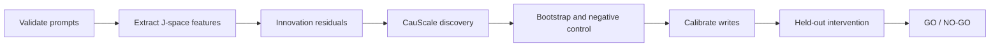

# Task 3 V1 Stage 1 - Graph Validation

Last updated: 2026-07-27

Version: **V1 baseline**. Future redesign work belongs in `task3_v2`.

## Purpose

Stage 1 tests whether selected token-anchored J-space coordinates contain
stable and intervention-supported downstream structure.

If successful, its output is a candidate graph that can support a limited
causal interpretation. This is an optional causal-audit track, not a mandatory
prerequisite for fixed-graph semantic recovery.

## Scope concern

- Task 1/2 assumes a graph; the current Stage 1 adds causal discovery as an
  extra and substantially harder gate.
- `concept@layer` nodes are repeated views, not clearly separate semantic
  variables, and the 32 probe tokens have no known ground-truth causal DAG.
- J-space projections are not causally sufficient variables: unmeasured hidden
  states may confound them, while a single-source write measures total effect,
  not a direct edge.

Accordingly, Stage 1 failure blocks causal claims about the discovered graph,
but should not block the core semantic-recovery experiment with a fixed or
controlled graph.

## Flow

## Core tests

| test | purpose | pass requirement |
|---|---|---|
| Prompt validation | Confirm prompts elicit the intended probe concepts | Static and behavioral checks pass; dataset is frozen |
| Feature validation | Confirm J-space coordinates are measurable | No invalid or zero-variance columns; expected concept enrichment |
| Innovation | Remove trivial same-concept propagation | Stable cross-concept structure remains |
| CauScale | Discover directed candidates | Only lower-layer to higher-layer candidates are accepted |
| Bootstrap | Test sampling stability | Probability >= 0.5, frequency >= 0.8, and adequate graph overlap |
| Negative control | Test whether structure survives after real alignment is destroyed | Real data clearly exceeds the permutation null |
| Write calibration | Confirm one coordinate can be changed selectively | Target error and mean same-layer off-target movement <= 0.1 SD |
| Held-out intervention | Test downstream effects on independent prompts | \(q<0.05\), RMS effect >= 0.1 SD, and stronger than frozen controls |

Same-concept edges are retained only as positive controls and are excluded
from the primary cross-concept graph. Higher-layer to lower-layer and
within-layer directed edges are excluded.

## Key metrics

- **Selection frequency:** how often one edge reappears across bootstrap runs.
- **Median Jaccard:** overlap between complete bootstrap edge sets.
- **SD dose:** intervention size measured in the coordinate's natural standard
  deviation; current doses are `-2`, `-1`, `+1`, and `+2` SD.
- **Target error:** distance between the achieved and requested source
  coordinate.
- **Off-target movement:** unintended movement of other coordinates at the
  written layer.
- **RMS effect:** practical downstream target movement in SD units.
- **q-value:** multiple-comparison-corrected significance value.

Held-out source intervention establishes a total downstream effect. It does
not by itself prove that the discovered edge is direct.

## Current result

The most promising exploratory layer set is `[18, 19, 24, 25]`.

- 21 stable innovation cross-concept candidates;
- Median Jaccard: 0.211;
- five within-fold permutation controls: zero stable edges;
- the joint 992-node all-layer graph was unstable and is not preferred.

## Current decision

**Stage 1 has not formally passed.**

This NO-GO applies to causal interpretation of the discovered graph, not to
the core Task 3 semantic-recovery test with a fixed or controlled graph.

Completed:

- controlled-current32 static validation;
- feature extraction;
- innovation and CauScale discovery;
- bootstrap filtering;
- permutation negative control.

Still required:

1. behavioral validation and dataset freezing;
2. write calibration at layers `[18, 19, 24, 25]`;
3. freezing 3-5 candidate edges and matched controls;
4. independent held-out interventions.

Stage 1 becomes **GO** only if multiple preselected cross-concept candidates
show significant and practically meaningful held-out effects beyond
correlation and matched-random controls.
