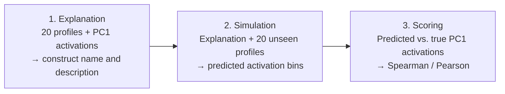

<!-- External-baseline report outline -->

# Slide 1｜This Update Consolidates Five External Baselines

## Scope of this report

- Complete Task 1 and Task 2 results for **Feature Propagation** and **GraphMAE-GCN** across the full 19-dataset benchmark.
- Three newly added interpretability baselines: **CLIP-Dissect (E5 text adaptation)**, **Automated Interpretability**, and **Delphi**.

---

# Slide 2｜Task 1: Core vs. Feature Propagation and GraphMAE-GCN

## Five-fold Match-ACC on all 19 datasets

**Bold indicates the best method in each row; ties are all bolded.**

| Dataset | Core (ours) M | Feature Prop. M | GraphMAE-GCN M |
|---|---:|---:|---:|
| HEXACO | **.483** | .283 | .183 |
| 16PF | **.698** | .291 | .099 |
| HiMI | **1.000** | .900 | .767 |
| RIASEC | **.840** | .360 | .358 |
| Big Five | **.800** | .340 | .180 |
| GCBS | **1.000** | **1.000** | .667 |
| HS | **.840** | .740 | .450 |
| TLVD | **1.000** | **1.000** | .800 |
| HSQ | **.638** | .510 | .419 |
| KIMS | **.800** | .643 | .307 |
| Dark Triad | .700 | .650 | **.720** |
| SD3 | **.747** | .327 | .547 |
| RSE | **1.000** | .600 | .600 |
| SCS | **.800** | .400 | **.800** |
| CFCS | **.667** | .467 | **.667** |
| MACH | **.800** | .150 | .500 |
| NPAS | **.160** | .113 | .080 |
| TMA | **.520** | .160 | .120 |
| WPI | **.233** | .052 | .035 |
| **Dataset macro** | **.722** | .472880 | .436717 |

---

# Slide 3｜Task 2: Core vs. Feature Propagation and GraphMAE-GCN

## Five-fold Match-ACC on the 12 multi-factor datasets

**Bold indicates the best method in each row; ties are all bolded.**

| Dataset | Core (ours) M | Feature Prop. M | GraphMAE-GCN M |
|---|---:|---:|---:|
| HEXACO | .593 | **.660** | .240 |
| 16PF | .412 | **.638** | .263 |
| HiMI | **1.000** | **1.000** | .233 |
| RIASEC | **.867** | **.867** | .300 |
| Big Five | .440 | .440 | **.520** |
| GCBS | **.920** | **.920** | .120 |
| HS | **1.000** | **1.000** | .720 |
| TLVD | **.500** | **.500** | .250 |
| HSQ | **1.000** | **1.000** | **1.000** |
| KIMS | **1.000** | **1.000** | .400 |
| Dark Triad | **1.000** | .600 | .700 |
| SD3 | **1.000** | **1.000** | .333 |
| **Dataset macro** | **.811** | .802014 | .423264 |

---

# Slide 4｜CLIP-Dissect, Adapted to Text with E5, Covers Both Tasks

Originally, CLIP-Dissect labels vision-network neurons by comparing their image activation patterns with candidate concept embeddings. SoftWPMI is its main association score; rank reordering is an evaluated alternative. Neither requires labeled examples or an LLM generator.

## Adaptation to this project

1. Replace CLIP image–text comparison with frozen E5 profile–concept similarity.
2. Replace the paper's usual Common-20k vocabulary with a fixed 4,096-concept WordNet psychology/cognition bank, and combine SoftWPMI with rank reordering by equal-weight Borda.
3. Use each masked item's response column for Task 1 and respondent-level latent activations for Task 2.

## Fixed settings

| Setting | Value |
|---|---|
| Concept bank | 4,096 data-independent WordNet concepts|
| Association score | Equal-weight Borda combination of SoftWPMI and rank reordering |
| Tie policy | Tie-aware midranks; lexical concept identity only as presentation tie-break |
| Scorer | `text-dissect-e5-tie-neutral-v3` |
| Output | Top-1 construct name + ranked top-6 concepts; positive and negative poles retained |

## Corrected v3 results

| Task | Coverage | Match-ACC |
|---|---:|---:|
| Task 1 | 19 datasets · 929 items · 95 folds | **0.324369** |
| Task 2 | 19 datasets · 495 latent-folds · 95 folds | **0.303611** on multi-factor 12 |

### Sources

- [Oikarinen and Weng, “CLIP-Dissect”](https://arxiv.org/abs/2204.10965)
- [Wang et al., “Text Embeddings by Weakly-Supervised Contrastive Pre-training”](https://arxiv.org/abs/2212.03533)
- [Princeton WordNet](https://wordnet.princeton.edu/)

---

# Slide 5｜Automated Interpretability Names a Latent and Scores It by Simulation

Automated Interpretability (Bills et al.) explains individual language-model neurons from token-level activation examples and evaluates each explanation by its ability to predict held-out activations.

## Explanation → simulation → scoring

## Adaptation to this project

1. Use a respondent-level PC1 score instead of a pre-existing language-model neuron activation.
2. Replace token sequences with fold-visible respondent profiles from high- and low-response observed items.
3. Require structured output containing a neutral 1–4-word construct name alongside the explanation.

## Fixed settings and results

| Setting | Value |
|---|---|
| Explanation / simulation profiles | 20 / 20 disjoint profiles |
| Visible profile text | Top 6 high-response + top 6 low-response observed items |
| Explainer / simulator | `gpt-4o-mini`, temperature 0 |
| Native fidelity | Spearman primary; Pearson secondary |
| Task 1 coverage | 19/19 datasets · 929/929 items · 95/95 folds |
| Task 1 Match-ACC | **0.283633** |
| Task 1 dataset-macro Spearman / Pearson | **-0.018 / -0.025** |
| Task 2 coverage | 19/19 datasets · 495/495 latent-folds · 95/95 folds |
| Task 2 Match-ACC, multi-factor 12 | **0.171736** |
| Task 2 dataset-macro Spearman / Pearson | **0.097 / 0.093** |

### Sources

- [Bills et al., “Language Models Can Explain Neurons in Language Models”](https://openaipublic.blob.core.windows.net/neuron-explainer/paper/index.html)
- [Official Automated Interpretability code](https://github.com/openai/automated-interpretability)

---

# Slide 6｜Our Delphi Adaptation Adds Hard Negatives and Detection-Based Selection

Originally, Delphi scales automated interpretation to sparse-autoencoder features in language models. It generates descriptions from activating contexts and evaluates them with detection-, simulation-, and intervention-based scorers.

## Adaptation to this project

1. Replace SAE token contexts with respondent profiles and PC1 activations.
2. Generate three candidate interpretations from 15 strongly activating profiles and 5 negative profiles, rather than one interpretation from activating contexts.
3. To avoid test-set leakage and obtain an unbiased final estimate, use 40 balanced validation profiles to select the best candidate (primarily by AUROC and secondarily by F1), then evaluate it on 40 disjoint held-out profiles.

## Execution status

| Field | Value |
|---|---|
| Model | `gpt-4o-mini`, temperature 0 |
| Task 1 coverage | **19/19 datasets · 929/929 items · 95/95 folds** |
| Task 1 Match-ACC | **0.256013** |
| Task 1 dataset-macro AUROC / F1 | **0.564 / 0.426** |
| Task 2 coverage | **19/19 datasets · 495/495 latent-folds · 95/95 folds** |
| Task 2 Match-ACC, multi-factor 12 | **0.265000** |
| Task 2 dataset-macro AUROC / F1 | **0.621 / 0.456** |

### Sources

- [Paulo et al., “Automatically Interpreting Millions of Features in Large Language Models”](https://proceedings.mlr.press/v267/paulo25a.html)
- [Delphi article-version code](https://github.com/EleutherAI/delphi/tree/article_version)

---

# Slide 7｜Task 1 Results by Dataset

**All values are Match-ACC. Bold indicates the best method in each row; ties are all bolded.** Core values are copied from the current README. CLIP-Dissect E5 is the formal report-19 v3 adaptation run.

| Dataset | Core (ours) M | CLIP-Dissect E5 M | Automated Interp. M | Delphi M |
|---|---:|---:|---:|---:|
| HEXACO | **.483** | .083 | .021 | .025 |
| 16PF | **.698** | .086 | .043 | .050 |
| HiMI | **1.000** | .417 | .600 | .283 |
| RIASEC | **.840** | .269 | .147 | .189 |
| Big Five | **.800** | .260 | .080 | .260 |
| GCBS | **1.000** | .400 | .267 | .267 |
| HS | **.840** | .380 | .180 | .460 |
| TLVD | **1.000** | **1.000** | .400 | .400 |
| HSQ | **.638** | .090 | .252 | .195 |
| KIMS | **.800** | .382 | .179 | .150 |
| Dark Triad | **.700** | .360 | .140 | .140 |
| SD3 | **.747** | .233 | .220 | .200 |
| RSE | **1.000** | .600 | .400 | .400 |
| SCS | **.800** | .600 | **.800** | **.800** |
| CFCS | **.667** | .533 | **.667** | .467 |
| MACH | **.800** | .200 | .650 | .350 |
| NPAS | .160 | .120 | **.187** | .080 |
| TMA | **.520** | .080 | .140 | .080 |
| WPI | **.233** | .068 | .017 | .069 |
| **Dataset macro** | **.722** | .324369 | .283633 | .256013 |

---

# Slide 8｜Task 2 Results by Dataset

## Twelve multi-factor datasets

**All values are Match-ACC. Bold indicates the best method in each row; ties are all bolded.** Only datasets with a defined Task 2 matching problem are shown.

| Dataset | Core (ours) M | CLIP-Dissect E5 M | Automated Interp. M | Delphi M |
|---|---:|---:|---:|---:|
| HEXACO | **.593** | .080 | .040 | .047 |
| 16PF | **.412** | .100 | .088 | .100 |
| HiMI | **1.000** | .267 | .000 | .200 |
| RIASEC | **.867** | .133 | .200 | .533 |
| Big Five | .440 | **.520** | .200 | **.520** |
| GCBS | **.920** | .240 | .000 | .280 |
| HS | **1.000** | .720 | .200 | .200 |
| TLVD | **.500** | .250 | .250 | .350 |
| HSQ | **1.000** | .350 | .050 | .300 |
| KIMS | **1.000** | .350 | .600 | .250 |
| Dark Triad | **1.000** | .300 | .300 | .200 |
| SD3 | **1.000** | .333 | .133 | .200 |
| **Dataset macro** | **.811** | .303611 | .171736 | .265000 |

---
